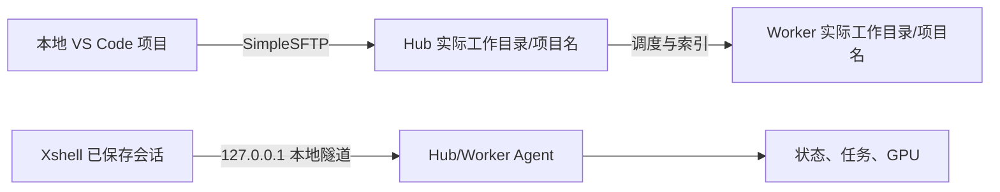
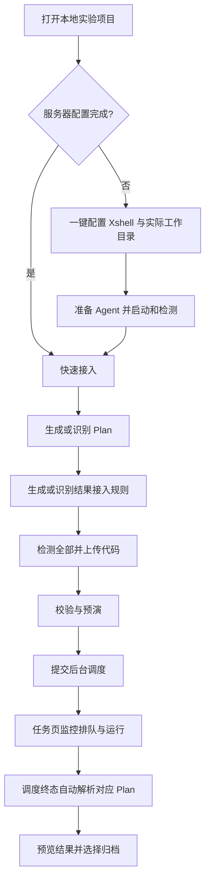

# SimpleExperiment 配置说明

## 最快接入路径

一键配置已保存 Xshell 会话和服务器项目父目录但尚未打开工作区时，会把“打开项目文件夹”作为唯一主动作；选择真实单项目后再继续 SimpleSFTP 目标、Agent 准备和项目接入。

从命令面板执行“接入当前项目”或“准备 Agent 并启动”时，如果尚未打开工作区，选择一个本地单项目文件夹后插件会等待工作区状态刷新并自动继续原流程，不需要再次点击命令。取消选择、仍未打开项目或选择多根工作区时会停止在当前步骤，不会写入项目文件、上传代码、部署 Agent 或提交实验。

每个 VS Code 窗口只打开一个实验项目。多根工作区会在项目接入、Agent 路径写入、SFTP 上传和远端实验操作前被阻断；请把目标实验项目单独打开，避免上传目录、Plan 与项目状态指向不同文件夹。切换工作区目录后，插件会清空上一项目的 Plan、任务、结果、离线覆盖、同步和操作内存状态，并从新项目的 `simple_cluster/ui/` 重新加载；Hub/Worker 与 Xshell 全局设置不会被清除，旧项目尚未完成的项目状态文件回读、检测、快照或实时回调不会写入新项目。

```text
Xshell 会话 -> SimpleExperiment 服务器目录 -> SimpleSFTP 目标 -> 准备 Agent -> 运行 Plan
```

| 阶段 | 完成标准 |
| --- | --- |
| 安装 | VS Code 已安装 SimpleSFTP 与 SimpleExperiment |
| Xshell | Hub 和每个 Worker 都有可直接登录的已保存会话 |
| 服务器目录 | 每台服务器都填写了真实、可写的实验根目录 |
| 检测 | “检测全部”显示 Hub 与启用 Worker 可达且 Agent 版本兼容 |
| 接入 | 当前项目已有 Plan 与结果输出接入规则 |
| 上传 | Hub 与所需 Worker 的代码 fingerprint 一致 |
| 运行 | 校验和预演通过后进入后台任务监控 |

从插件内打开本说明时，VS Code 会显示渲染预览，并提供“开始一键配置”和“打开面板”入口。离线安装包中的 `simple-experiment-setup.md` 是同一份独立说明文件，可直接随安装包分发和查看。

命令面板提供“一键配置向导”“快速接入当前项目”和“准备 Agent 并启动”三个主入口。“启动全部 Xshell 连接”仅打开现有会话。面板打开后会自动检测已配置的 Hub/Worker；端点未启动时仍保留“准备 Agent 并启动”和“检测全部”用于恢复。一键配置不会把只填写主机和端口当成完整接入，缺少 `.xsh` 会话时会要求重新选择；仅配置 Hub 时会在部署 Agent 前直接引导添加执行 Worker。重复或无效本地端口、多个 Agent 复用同一个 `.xsh` 会话，以及非 `127.0.0.1`、`localhost` 或 `::1` 的转发都会在打开连接、修改会话文件和部署 runtime 前阻断。

服务器配置不完整时，SimpleExperiment 首次启动会显示一次引导，可直接打开本说明或开始一键配置；服务器仅配置 Hub 时会明确提示正式运行缺少执行 Worker，并提供“添加 Worker”入口；配套 SimpleSFTP 缺失或 ABI 过旧时，也会直接提示安装依赖并提供说明与扩展管理入口。依赖、服务器和至少一个启用 Worker 均就绪的用户不会收到该提示；用户中途取消后下次启动仍会继续引导。直接从命令面板运行“一键配置向导”或“准备 Agent 并启动”也使用相同门禁。部署 Agent、代码同步、忽略规则和运行前自动同步会在同步 Xshell 配置或写共享目标前再次执行该门禁；依赖未就绪时不会修改 `.xsh`、启动会话、显示上传开始或写入远端。独立的“启动连接”和“写入 Agent 自启动命令”仍可用于不涉及文件上传的故障恢复。面板顶部长期保留“配置说明”入口。

一键配置遇到缺失会话、缺少 Worker、SimpleSFTP 目标不完整或 Agent 准备冲突时，“打开服务器设置”会直接定位到对应区域。向导连续推进时不会额外叠加 Worker 保存成功通知；从服务器设置手动保存 Hub 或 Worker 时会显示最终代码与 runtime 位置，配置完整后可直接继续“准备 Agent 并启动”。只有 Hub 时引导添加 Worker；未打开项目时引导查看配置说明。



## 1. 安装

项目接入区的五个阶段按基础设施、Plan 与输出、Agent 连接、运行与监控、结果与归档显示当前 Plan 状态。第一个未完成阶段会标为当前步骤，后续阶段保持待处理样式；点击阶段卡可直接定位到对应区域，具体操作仍以“下一步”提示为准。

安装 `SimpleSFTP` 与 `SimpleExperiment` 两个 VSIX。两者必须同时安装。推荐直接运行离线包中的 `install-public-release.ps1`：脚本会先安装并核验公开版，再移除旧的 `simple-local.simple-sftp-manager` 和 `simple-local.simple-experiment`，避免新旧插件同时注册相同命令或面板；不会卸载其它扩展，现有 `simpleExperiment.*` 设置和项目内配置继续沿用。安装后先重载所有已打开的 VS Code 窗口，再开始配置。项目接入与首屏门禁会检查 SimpleSFTP 的 `uploadWorkspace`、`uploadFiles`、`configureIgnores` 编排 ABI；未安装、未启用或版本过旧时显示“待安装 SimpleSFTP”，并直接提供配置说明入口，不会在提交后才暴露上传命令缺失。

卸载旧版后，已经打开的 VS Code 窗口仍可能由旧 extension host 暂时保留旧私有版状态栏按钮，同时显示新版 `SimpleSFTP` 按钮。此状态不代表旧版仍被安装，也不会生成两份任务；在命令面板执行 `Developer: Reload Window` 后，旧状态栏对象会释放。扩展列表应只保留 `simple-local.simple-sftp` 和 `simple-local.simple-experiment`。多用户共用服务器时，把 `simpleExperiment.tunnel.remoteTmuxSessionPrefix` 设为稳定的用户名或短标识；该前缀用于 Agent 和任务 tmux 会话名，默认值为 `simple`。

如果新版 SimpleSFTP 已可用但旧版扩展仍安装，SimpleExperiment 首次启动会单独提示旧版来源，并可直接打开旧版扩展管理；该提示不阻断新插件或已有任务。卸载旧版后重载窗口，界面只保留新版按钮。选择“不再提示”只关闭这条迁移提示，不会关闭运行、上传或路径确认门禁。

SimpleExperiment 命令面板默认只显示新项目主流程和常用连接入口。旧自动隧道、单端点启动、实时流控制、诊断与离线恢复命令仍然存在，面板内原按钮和直接命令 ID 不变；需要从命令面板调用时，打开插件面板“设置 -> 高级命令 -> 打开命令设置”，再启用 `simpleExperiment.showAdvancedCommands`。

运行门禁、同步状态和发布流程会把 fingerprint 显示为“代码指纹”；未选择 Plan 时显示“需要选择计划”，悬停仍可查看原始 fingerprint。运行确认窗口同样显示“核验代码指纹”，不改变内部 fingerprint 字段。

## 2. 配置 Xshell

为 Hub 和每个 Worker 创建已保存的 Xshell 会话。每个会话应能连接对应服务器，并已保存本地端口转发。不要把 SFTP 用于日志、GPU 或任务状态。

## 3. 配置服务器目录

打开 SimpleExperiment 面板，先运行“一键配置向导”，选择 Xshell 会话。向导会要求填写 Hub 和每台 Worker 的“项目父目录”；之后仍可在“设置 -> 服务器”修改。

向导完成后会把当前项目的 Hub/Worker 上传目标写入 SimpleSFTP。共享目标路径是 `<项目父目录>/<当前项目名>`；项目父目录本身不是代码目录，插件会自动追加当前项目名。切换到另一个本地项目后重新运行向导或首次上传，会更新为该项目对应的路径。切换项目后还必须点击“准备 Agent 并启动”，使 Xshell 自启动命令和 Agent `projectRoot` 同步切换到新项目。

| 项目 | 必填内容 |
| --- | --- |
| Xshell 会话 | 已保存 `.xsh` 会话，包含插件使用的本地端口转发 |
| 项目父目录 | 服务器上用于存放多个项目的可写父目录，不要填写当前项目名或 `simple_agent` |
| 用户名和 SSH 端口 | 从 Xshell 会话读取；与服务器实际登录一致 |
| 本地端口 | 不与其他 Xshell 隧道冲突 |

```text
本地项目名：my_project

Hub 项目父目录：/remote/experiments
  - 代码上传到 /remote/experiments/my_project
  - Agent runtime 位于 /remote/experiments/simple_agent

Worker 项目父目录：/remote/experiments
  - 代码上传到 /remote/experiments/my_project
```

填写前先确认每台服务器的目录存在或当前用户有创建权限。保存后，点击“准备 Agent 并启动”：插件会先为本地 `.xsh` 写入受管自启动命令，再通过 SimpleSFTP 部署 runtime、打开会话并检测全部。已有非 SimpleExperiment `RemoteCommand` 时会在远端部署前停止且不会覆盖；故障恢复时也可独立使用“检测全部隧道”。目录、Xshell 会话或端口未确认前，不要上传或运行。

“检测全部”按 Hub 和每个已启用 Worker 汇总结论。只有全部通过才显示成功；Worker 失败、超时或未实际检测时会显示警告及对应服务器的修复建议。禁用 Worker 不影响本次结论。

## 4. 接入项目

打开本地实验项目，在面板点击“快速接入”。它会创建缺失 Plan 和结果接入模板。创建 Plan 时先选择“训练并评估”“仅训练”或“仅评估”，之后只要求该模式实际使用的入口和命令；多入口项目会要求明确选择对应脚本，多配置项目会要求选择 Plan 配置。插件会静态读取 `argparse`、Click 或 Typer 参数声明，只建议入口真实接受的参数，再要求确认写入 Plan 的命令。静态识别不会导入或执行项目代码；未识别的位置参数、配置参数和结果参数会在确认框中提示，需要人工补齐。入口要求 `{config}` 但未发现配置时，必须先创建并填写真实配置路径；入口不使用配置时会自动生成最小 YAML，不会留下无法运行的占位路径。随后必须确认实际最后执行命令生成的最终结果文件；仅训练模式使用训练命令，仅评估和训练并评估模式使用评估命令。写入前的最终摘要会同时列出运行模式、入口、命令、结果路径、任务数和配置中的 epoch、step、iteration 或训练样本限制；仅评估不会显示训练规模警告。插件会把确认后的项目内相对结果路径写入 `paper.result_csv`；该路径随后统一用于结果解析、归档、统计、论文表和 PPT，不能填写服务器绝对路径或项目外路径。首次生成的 Plan 固定为单 case、单 seed。若已有完整配置，也应先选择 smoke 配置，再检查 `base_config`、所选模式命令和结果输出路径。

`configs` 下的 YAML、YML、JSON 和 Python 配置都会参与扫描、推荐和参数预览。JSON 会先按结构解析；Python 配置只静态读取顶层赋值和任务、指标、结果路径线索，不导入模块、不执行配置代码。Plan 目录仍只识别 YAML/YML，普通配置与结果文件不会被误当成 Plan。文件名包含 `smoke` 或 `debug` 只作为提示；没有可静态确认的小 epoch、step、iteration 或样本限制时仍会显示规模警告。

多配置项目优先推荐名称或子目录明确包含 `smoke`、`sanity`、`debug`、`quick`、`tiny`、`mini`、`small` 或 `toy` 的配置，其次选择明确的 `base` 或 `default` 配置。选择列表会直接显示可静态确定的 epoch、step、iteration 和训练样本限制，并标记“小规模参数”“需核对规模”或“未预读规模”。为避免大配置集拖慢首跑，只预读前 24 个高优先级配置；无论是否预读，最终选择都会在创建 Plan 前再次检查。`configs/` 目录名不会让所有配置都被误标为推荐；没有这些信号时保持扫描顺序并要求人工确认。

配置参数预览最多读取 80 个文件，但会先按同一首跑优先级排序。大型项目中的 smoke 配置即使文件名靠后，也会优先进入摘要，不会被普通完整配置挤出预览范围。
配置参数预览会把 YAML、JSON、Python、单值、对象和列表等内部类型显示为中文标签；悬停仍可查看原始类型，打开动作明确写为“打开配置文件”。
项目接入规则摘要和详情会把 `classification`、`segmentation`、`regression`、`detection` 等内部任务类型显示为“分类”“分割”“回归”“目标检测”；配置编辑器仍保留原始值，未知类型原样显示。

命令使用 `{result_csv}` 且未写死结果文件时，默认结果路径位于 `{output_dir}` 下。引导 Plan、矩阵 Plan 和预置项目模板使用相同规则；后续增加多个 case 或 seed 后，各任务不会并发写入同一个项目级 CSV。命令已明确固定结果文件时仍按原路径处理，并要求最终确认。

“项目关键入口”的“环境”行会同时显示 Hub/Worker 使用的 Conda 环境和项目依赖清单，可直接打开 `environment.yml`、`requirements*.txt`、`pyproject.toml`、Pip/Poetry/uv 锁文件或 `requirements/` 子目录清单。缺少依赖清单不会阻止使用服务器上已有的 Conda 环境，但首次运行前应确认该环境已安装项目所需依赖。

“项目关键入口”的“结果位置”优先显示当前选中 Plan 声明的可解析输出，其次显示 `experiments/simple_project.yaml` 接入规则或已经发现的真实结果文件；不会在没有证据时用通用 `metrics_summary.csv` 占位。当前 Plan 已完整声明输出时，“接入”行会明确显示无需额外模板。首次运行尚无结果文件是正常状态，不会被误显示为必须先完成结果预览。

项目配置识别同时覆盖 `configs/`、`config/`、`conf/`、`cfg/`、`experiments/configs/`、`experiments/config/` 和根目录常见 `config.*`、`hparams.*`、`params.*`、`settings.*`。生成 Plan 与项目关键入口使用同一组候选和首跑优先级，不再因为项目未采用 `configs/` 目录名而要求手动输入已经存在的配置。

执行校验、预演或运行前，插件会检查 Plan 引用的本地配置文件，以及命令中明确写出的相对 Python 脚本是否真实存在。`python -m package`、服务器绝对路径和非 Python 启动命令不会被本地路径门禁误拦截。插件还会比较 Hub/Worker `/api/health` 返回的 `projectRoot` 与当前工作区对应的远端目录；Hub 不一致会阻断校验和预演，Hub 或任一启用 Worker 不一致会阻断运行、复现和运行全部计划，并引导重新“准备 Agent 并启动”。



## 5. 上传与运行

运行 Plan、Debug 首跑、复现实验或运行全部计划时，活跃任务重复提交检查仍优先执行；通过后才检查 SimpleSFTP。依赖未就绪时会先显示安装说明，不会先弹出包含远端路径的运行确认窗口。

首次配置使用“准备 Agent 并启动”，一次完成受管自启动命令、runtime 部署、Xshell 启动和连接检测；一键配置会先确认 Hub/Worker 均有 `.xsh` 会话和实际工作目录，并至少存在一个启用 Worker。准备 Agent 前必须打开要运行实验的本地项目，插件不会把 Agent 部署到通用占位项目目录；检测通过后可直接点击“快速接入当前项目”。明确选择“仅保存 Hub”时只保存 Hub 与 SimpleSFTP 目标，不会误导为可提交实验。独立的部署、写入、启动和检测按钮用于故障恢复。“启动连接”本身只打开已有 Xshell 会话。Hub 负责控制与调度，正式实验至少需要一个已启用的 Worker；仅配置 Hub 时仍可管理 Plan，但运行、复现和运行全部计划会在上传前阻断，并引导到“设置 > 服务器”添加 Worker。“快速接入”会沿用当前明确选中的 Plan；检测到多个 Plan 且尚未选择时会先要求选择本次目标，不会默认使用列表第一项。切换目标且 Agent 连接就绪后会立即请求新 Plan 的结果摘要；返回前不会显示上一 Plan 的结果、质量门禁、统计、论文证据或 PPT 契约。接入完成后会即时检测端点，并按结果输出门禁、服务器配置、Worker 和 Agent 的真实状态只给出一个下一步；仅当全部通过时才显示“校验并提交运行”。快速接入不会无条件打开 Plan；新生成的接入说明会保持可见，只有用户选择“打开当前 Plan”或“打开接入配置”时才切换编辑器。从该流程进入服务器配置或 Agent 准备时，检测通过后会继续提供“校验并提交运行”，无需返回面板重新寻找入口。单 Plan 确认框会列出 Plan、模式、任务数、基础配置和 Worker；批量运行会先完成本地输出门禁和配置检查，再用强制确认窗口列出计划总数、已知任务总数、Worker 及各 Plan 的模式和配置。确认后插件才同步 Hub 和 Worker，再校验、预演并提交后台调度；取消不会上传代码或执行远端预演，任一批量 Plan 未通过时整批停止提交，不必把手动上传当作首跑必经步骤。“单独校验”和“单独预演”保留给需要提前核对门禁的场景；校验或预演失败时，“下一步”会切换成对应的重新执行动作。工作台会显示最近校验任务数、预演可调度数、排队数和失败原因。提交后直接在“任务”页监控，不会提前解析旧结果；最后一个任务进入完成、失败、取消或停止终态后，Hub 会按该次 operation 的 `planFile` 自动检查输出契约并生成完整预览结果。多 Plan 同时运行时各自写入独立结果目录，不会因当前 UI 选择而串 Plan。完整预览先用于人工对比并选择归档；质量门禁只检查已归档结果，随后插件才提示生成最终统计、论文证据、论文表与 PPT 数据。未归档记录保留在完整预览中，不进入后续分析。复现实验和运行全部计划也会再次检查服务器目录、配置文件与结果输出门禁，并重新校验和预演后才提交。

多 Plan 项目按当前 Plan 单独检查输出契约；其他 Plan 的结果路径只参与本地文件发现，不会错误放行当前 Plan。明确保存的 `experiments/simple_project.yaml` 候选，以及由项目代码、配置或工厂模式证据推断出的通用候选，才作为项目级共享规则。

本地“结果解析预览”只显示与当前 Plan 模板或项目级共享规则匹配的文件，并显示已隐藏的其他 Plan 候选数量。运行工作台的预览计数与输出门禁使用同一作用域，切换 Plan 后不会沿用上一 Plan 的本地预览数量。

结果工作台将数据集、检查点、统计、论文表格和样本级分析入口显示为中文；悬停信息仍保留原始字段名，方便兼容排查。

运行结束但输出契约缺少文件时，“项目关键入口”会列出具体缺失文件。尚无 `experiments/simple_project.yaml` 时生成接入模板；已有接入配置时只打开现有配置，不重复覆盖模板。修改接入配置或项目输出后，可直接用同一行的“修复后重新运行”重新同步、校验、预演并提交当前 Plan。

同一 Plan 已有未结束的提交操作或排队、运行、测试任务时，运行按钮会改为任务或操作进度入口。后端也会在确认、上传和预演前阻止重复提交；批量运行发现任一活跃 Plan 时整批停止，避免同一配置重复占用 GPU。概览会显示真实进行中、失败、成功终态及最近 operation 状态，不再用静态说明代替运行进度。

同一路径的旧 Plan revision 仍在运行时，当前版本也会被保护性阻止提交，避免共享远端项目目录和代码同步影响旧任务。项目入口会明确显示旧版本仍活跃，并提供“查看全部任务”；旧任务仍可正常监控、停止、重试、解析或归档，当前 revision 的任务和结果不会被混入。

操作进度、资源树、右侧详情和概览最近操作会把内部 operation 状态与 `validate-plan`、`run-plan`、`parse-results` 等类型显示为中文名称；悬停和搜索仍保留原始状态或 operation type，未知类型保持原文。

“项目关键入口”的状态角标和状态行会跟随当前 Plan 生命周期。校验、预演、提交、运行、结果待处理和任务需处理使用不同状态；即使运行后修改了服务器配置或输出规则，当前运行或已结束结果仍优先显示，不会重新误报为可提交或普通接入缺失。

VS Code 重载或 operation 缓存暂时缺失时，插件会继续读取当前 Plan revision 的调度任务终态。全部 `normal_completed` 任务进入结果页；`manual_interrupted_completed`、失败、停止或取消任务进入任务页复核。Plan 已修改时，旧 revision 或早于当前 Plan 更新时间的任务不会被误当成当前运行。

提交前确认窗口会列出 Hub 汇总目录、每个执行 Worker 的真实项目目录和预期结果文件模板。优先使用当前 Plan 的输出声明；没有直接声明时显示项目接入配置中的候选文件。`{output_dir}` 表示每个任务实际展开的 job 输出目录；固定相对路径会与各服务器项目目录拼接显示。Worker 行是运行生成位置，Hub 行仅是同步后的预期汇总位置。停止、重试、检查同步清单、三方校验、归档和删除也会在强确认窗口中列出当前可确定的产物、结果和日志位置，并把任务标识分开显示；无法展开文件位置时会明确说明由 Hub Agent 按标识解析。“检查同步清单”不会传输文件，实际同步完成情况以真实文件同步流程和“三方一致校验”结果为准。

单 Plan 提交后，任务页默认聚焦当前 Plan revision。若调度状态尚未返回，会显示等待提示；可随时切换“全部任务”查看历史实验。运行全部计划提交后默认显示全部任务，停止、重试、解析、归档和删除入口保持不变。`failed`、`error`、`stalled`、`stopped`、`cancelled` 和 `canceled` 都按异常终态处理：保留在重点列表、显示失败样式、自动展开最终日志并允许重试；已经产生部分结果时仍可解析和归档，由用户决定是否纳入有效结果。Plan 归档也使用相同终态判断，不会把已经停滞或取消的任务误认为仍在运行。当前 Plan revision 的已知任务全部进入终态后，任务页会给出明确下一步：已有解析结果时显示结果数量并进入结果页；存在异常终态时直接提供“打开失败日志”，查看后再按需重试或保留部分结果；全部完成但结果尚未返回时进入结果页等待自动检查输出并解析。

运行前输出门禁未通过时，快速接入提示、Plan 工作台和项目门禁使用同一修复逻辑：已有接入配置就打开 `experiments/simple_project.yaml`，没有时才生成模板；Plan 本身缺少结果路径时仍保留“打开 Plan”。

已有运行结果但输出契约异常时，Plan 工作台会同步显示“待检查”“检查中”“运行缺失”或“待重新解析”，并使用与项目入口相同的检查契约、查看进度、打开接入配置、修复后重跑或重新解析操作，不再同时显示普通运行入口。

新建或修改研究项目前，先阅读 [plugin-project-contract.md](plugin-project-contract.md)。它定义工作区结构、Plan/config、输出接口、标准结果 schema、快照文件、Xshell/SFTP 路径边界、Debug 隔离和 API 使用的硬性要求。

运行前有两级检查。Extension 先检查输出声明；Scheduler 在 validate-plan 和 dry-run-plan 中用 Python AST 验证真实接口：优先使用 `experiments/simple_adapter/run_wrapper.py` 包裹命令；直接入口必须显式调用 `collect_outputs(...)` 或 `write_metrics_summary(...)`；也可改用 TensorBoard SummaryWriter，但远端需安装 `tensorboard`，任务结束后会自动把最终 scalar 转成标准 CSV。只写 `result_csv` 或 `output_dir` 不代表代码真的会输出结果。运行后的契约检查仍会实际解析 CSV、JSON、TXT、LOG、OUT，并要求至少一个数值指标和 `env_snapshot.json` / `config_snapshot.yaml`。Dry-run 只清理精确命名的 runtime worker 临时文件，不扫描或删除其他路径。

“不可解析”文件会逐项显示文件名与 Agent 返回的真实解析原因，并在同一行提供“查看文件”入口。入口仅允许当前 Plan 最近输出契约检查返回的项目内 CSV、JSON、TXT、LOG 或 OUT 文件。点击后会先显示当前 Plan、远端来源、项目内本地副本位置和 5 MB 上限；确认后通过 Hub 的 Xshell 本地隧道下载到 `simple_cluster/downloads/result_inspection/` 并打开，只读查看不会修改远端文件，也不会调用 SFTP。

结果页会监听当前 Plan 和 operation 变化。输出契约检查、异常诊断、恢复 Plan、Case 级解析或绘图契约进入终态后，对应报告和 PPT 按钮会立即刷新；切换 Plan 后不会因为结果页分区缓存仍显示上一 Plan 的检查状态或分析文件。

PPT 绘图入口只在当前 Plan 的结果摘要或成功操作已经返回真实分析文件路径后启用。未生成统计、论文表格、绘图契约、case level、异常报告或恢复报告时，对应按钮会保持禁用，不会尝试固定占位路径；切换 Plan 后也不会复用上一 Plan 的文件。目标 PPT 路径只保存在当前项目的 `simple_cluster/ui/ppt_plot_config.json`；新项目不会继承应用级路径或旧项目路径，留空时由 PPT 插件新建演示文稿。调用 PPT 插件前会显示强制确认窗口，列出当前 Plan/revision、最终结果源、绘图契约、完整目标 PPT、本地请求审计目录、图类型和样式。执行绘图请求时会在 `simple_cluster/results/ppt_plot_requests/` 写入轻量 JSON 请求和响应审计；提交通知可直接打开当前项目内的请求审计或响应审计文件。取消不会调用 PPT automation、写请求审计或显示已提交。选择“不再提醒”只对当前项目中完全相同的 PPT 目标生效，路径变化后会重新询问；记录保存在 `simple_cluster/ui/ppt_path_confirmations.json`，可在“设置 -> 服务器 -> PPT 路径提醒”中恢复，不会修改 PPT、结果或绘图配置。

完成结果归档后，“下一步”会依次引导质量门禁、统计、论文证据、论文表格、绘图契约和 PPT。发现缺证据 claim 时会打开 `paper/claims.md`，而不是重复检查同一份未修改内容；保存修正后点击“检查论文证据”，所有证据通过后才继续导出论文表格与绘图契约。旧版或离线导入的混合摘要缺少可靠顶层 `planFile` 时，切换 Plan 只保留带当前 Plan 标记的结果行并重新计算数量；原摘要中的 CSV 与分析产物路径不会继续显示，必须重新解析当前 Plan，避免把其他 Plan 的质量门禁、统计、claim、论文表或 PPT 状态当作当前结果。

SimpleExperiment 发起项目代码、Agent runtime 等任何 SFTP 上传前，都会先显示不可绕过的强制路径确认窗口。窗口逐个列出服务器账号、完整预期远端目录、预期远端文件位置和文件总数；Agent 准备及独立写入自启动命令的最终强确认窗口还会列出每个本地 `.xsh`、固定 `.simple-backup` 备份、runtime 远端文件与 Agent 项目工作目录。即使远端路径已经选择过“不再提醒”，最终操作确认仍显示这些预期文件位置。操作前可先在“设置 -> 服务器”核对每台服务器的“当前项目代码”和“Agent runtime”完整位置；编辑“实际工作目录”时会实时显示最终展开位置并标记“未保存预览”，只有点击保存服务器后才会用于上传和 Agent 启动。没有工作区时只显示可确定的 runtime，必须先打开目标本地项目后才显示代码上传位置，不会把 VS Code 或扩展进程目录误当成项目名。实际工作目录应填写项目父目录；末级与当前项目名相同时会显示重复目录警告并要求再次确认，警告窗口可一键改为上一级父目录，也可仍按当前目录使用；包含 `simple_agent` 会被阻止。向导、设置保存、共享 SFTP 配置、Agent 自启动和上传前共用这些规则。“项目关键入口”的“上传位置”会提供当前项目摘要。选择“确认位置并继续”只放行本次操作；选择“确认，此后不再提醒该路径/这些路径”会把服务器账号和完整路径记录在当前项目的 `simple_cluster/ui/remote_path_confirmations.json`。只有当前项目、服务器、账号、端口和全部关联路径完全一致时才跳过后续询问，任一路径变化都会重新确认。需要再次核对时，进入“设置 -> 服务器”，在“上传路径提醒”中点击“恢复提醒”；只会删除当前项目的免提醒记录，不修改服务器配置、SimpleSFTP 配置或远端文件。上述上传和忽略规则操作确认前不会更新对应 SimpleSFTP 共享目标、修改 `.xsh` 或显示上传已开始；取消窗口不会上传远端文件，也不会留下运行中状态。配置 SFTP 忽略规则也通过同一路径门禁，避免规则作用到错误目录。

## 6. 结果与归档

结果先进入预览 CSV。只有已归档实验记录会进入统计、论文表和 PPT 绘图；Plan 至少包含一条已归档有效结果才能归档，未采用记录继续作为排除记录保留。归档 Plan 会一并保存 Plan、独占配置、项目依赖环境清单、入口脚本、CLI 默认参数与 Plan 专属结果文件；YAML、JSON、Python 配置、flow map 内的 case 配置，以及 runner 命令中 `--config`、`--config-file`、`--cfg` 或 `config=` 指向的固定配置都随包保存并在恢复时改写。argparse、Click、Typer 声明只做静态扫描，不执行项目代码；快照保存显式和隐式默认值、`argument_default`、`set_defaults`、参数组、重复子命令参数及全部关键字表达式。动态名称、动态默认值、parser parents、namespace 默认值、Typer 普通函数签名或 Click 便捷装饰器会显示“参数待复核”，必须以运行产物内的 `config_snapshot.yaml` 或 `command.txt` 为准。“恢复新版本”会生成独立 `vN` Plan，把配置、环境和参数资料放入可上传的 `experiments/restored_assets/`，并改写全部配置引用；完成后自动回到 Plan 工作台，版本、快照与运行入口一起显示，避免配置丢失、环境不明或结果混合。

归档包会生成 `evidence/result_selection.json`，完整保存当前 Plan 每条结果的有效或未纳入状态、来源和关键维度。未纳入记录不会进入有效 CSV、统计或 PPT；归档卡可直接打开该清单复核，且不会混入其他 Plan。

Plan 卡会提前显示归档条件。任务未结束、结果未解析或尚无已归档有效结果时，归档按钮直接禁用并说明下一步。

已有项目可以直接输出 CSV、JSON 或文本指标。JSON 可使用记录数组、嵌套维度和嵌套指标，也可把指标写成 `{name, value}` 或 `{metric, score}` 列表；本地预览和服务器 Agent 会按同一规则解析。没有数值指标的状态 JSON 只作为普通文件，不会进入有效结果。

## 支持边界

SimpleExperiment 通过 Xshell 本地隧道访问 Agent。诊断区通信拓扑会区分 Worker 可用性批量上报、实时日志/GPU/任务推送和 SFTP 低频文件传输；实时状态不需要配置为 SFTP 文件流。SimpleSFTP 只传输真实文件。PPT 绘图只发送轻量统计或论文表，不扫描数据集、权重或 checkpoint。
